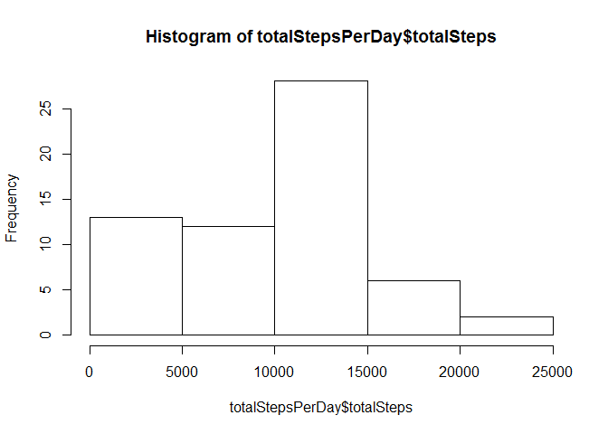
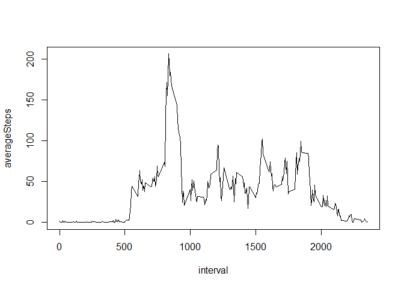
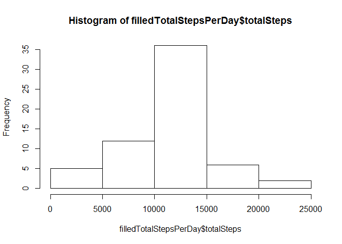
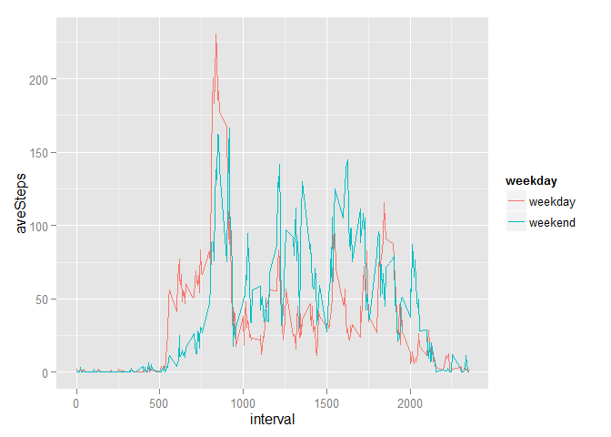

# Reproducible Research: Peer Assessment 1


## Loading and preprocessing the data


```r
data <- read.csv("activity.csv")
library(dplyr)
```

```
## 
## Attaching package: 'dplyr'
## 
## The following object is masked from 'package:stats':
## 
##     filter
## 
## The following objects are masked from 'package:base':
## 
##     intersect, setdiff, setequal, union
```

## What is mean total number of steps taken per day?

The histogram of the total number of steps taken each day is as follows


```r
totalStepsPerDay <- summarize(group_by(data, date), totalSteps = sum(steps, na.rm=TRUE))
hist(totalStepsPerDay$totalSteps)
```

 

From this we obtain the mean and median as


```r
mean(totalStepsPerDay$totalSteps)
```

```
## [1] 9354.23
```

```r
median(totalStepsPerDay$totalSteps)
```

```
## [1] 10395
```

## What is the average daily activity pattern?

The daily activity pattern is


```r
averageSteps <- summarize(group_by(data, interval), averageSteps = mean(steps, na.rm=TRUE))
with(averageSteps, plot(interval, averageSteps, type = "l"))
```

 

The interval containing maximum number of steps is


```r
with(averageSteps, interval[which.max(averageSteps)])
```

```
## [1] 835
```

## Imputing missing values

The total number of missing values in the dataset is


```r
sum(is.na(data$steps))
```

```
## [1] 2304
```

Now use the mean for each interval to replace the missing values


```r
intervalData <- split(data, data$interval)
fill <- function(intv) {intv$steps[is.na(intv$steps)] <- mean(intv$steps, na.rm = TRUE); intv}
filledData <- intervalData %>% lapply(fill) %>% unsplit(data$interval)
```

The histogram of the total number of steps each day of the filled data is


```r
filledTotalStepsPerDay <- summarize(group_by(filledData, date), totalSteps = sum(steps, na.rm=TRUE))
hist(filledTotalStepsPerDay$totalSteps)
```

 

The mean and median total number of steps taken per day is


```r
mean(filledTotalStepsPerDay$totalSteps)
```

```
## [1] 10766.19
```

```r
median(filledTotalStepsPerDay$totalSteps)
```

```
## [1] 10766.19
```

The values are different from the estimates from the first part of the assignment. Imputing missing data increases the total daily number of steps for each day.

## Are there differences in activity patterns between weekdays and weekends?

Here is the plot of daily activities averaged over weekdays and weekends respectively. They show some differences in their patterns.


```r
checkWeekday <- function(wkd) {
    if (wkd == "Saturday" || wkd == "Sunday") {
        return("weekend")
    } else {
        return("weekday")
    }}
weekdayData <- filledData %>% mutate(weekday = date %>% as.Date %>% weekdays %>% sapply(checkWeekday) %>% factor)
wkdayAveIntData <- weekdayData %>% group_by(weekday, interval) %>% summarize(aveSteps = mean(steps))
library(ggplot2)
g <- qplot(interval, aveSteps, data = wkdayAveIntData, color = weekday, geom = "line")
print(g)
```

 
